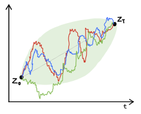
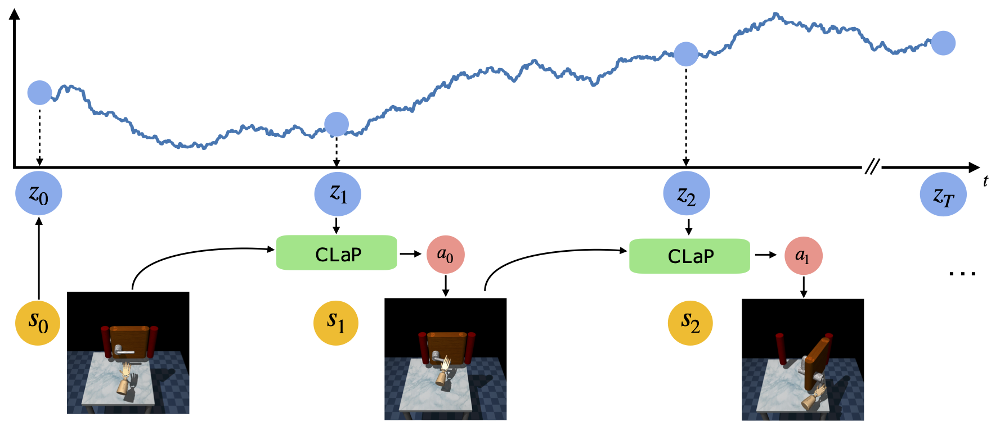

# CLaP: Conditional Latent Planners for Offline Reinforcement Learning
[[Paper]](https://openreview.net/forum?id=OQP7leJkAu)

**NeurIPS Foundation Models for Decision Making 2022**

**Harry D Shin, Rose E Wang**



## Introduction


**Abstract:** Recent work has formulated offline reinforcement learning (RL) as a sequence
modeling problem, benefiting from the simplicity and scalability of the Transformer
architecture. However, sequence models struggle to model trajectories that are
long-horizon or involve complicated environment dynamics. We propose CLaP
(Conditional Latent Planners) to learn a simple goal-conditioned latent space
from offline agent behavior, and incrementally decode good actions from a latent
plan. We evaluate our method on continuous control domains from the D4RL
benchmark. Compared to non-sequential models and return-conditioned sequential
models, CLaP shows competitive if not better performance across continuous
control tasks. It particularly does better in environments with complex transition
dynamics with up to +149.8% performance increase. Our results suggest that
decision-making is easier with simplified latent dynamics that models behavior as
being goal-conditioned.

Contents:
- [Installation](#installation)
- [Datasets](#datasets)
- [Encoder](#encoder)
- [Decoder](#decoder) 
- [Evaluation](#evaluation)

## Installation

1. Create a new virtual environment `conda create -n clap python=3.8`
2. In `encoder`, run: 
```
pip install -e . # Installing the right libraries for the virtual environment
cd encoder/goal_conditioning/transformers
pip install -e . # Installing transformers locally
```
3. Make sure you have a [wandb](https://wandb.ai/) account!
4. Change the filepaths to correspond to your own in [encoder/goal_conditioning/src/constants.py](encoder/goal_conditioning/src/constants.py) and [decoder/gym/constants.py](decoder/gym/constants.py).

## Datasets
Follow the setup instructions in the [original D4RL](https://github.com/Farama-Foundation/D4RL) repository to obtain a MuJoCo license.
Run the scripts at [decoder/gym/data/download_maze2d_dataset.py](decoder/gym/data/download_maze2d_dataset.py) and [decoder/gym/data/download_adroit_dataset.py](decoder/gym/data/download_adroit_dataset.py), which will place the datasets into the [decoder/gym/data](decoder/gym/data) folder.

## Encoder
The script for training the encoder can be found at [`encoder/goal_conditioning/scripts/final_encoder_scripts.sh`](encoder/goal_conditioning/scripts/final_encoder_scripts.sh)

An example command for training a Brownian bridge encoder on the Maze2D dataset: 

```
python scripts/train_encoder.py --config-name=brownian_bridge wandb_settings.exp_dir=maze2d_32 data_params.name=maze2d model_params.latent_dim=8
```

## Decoder

For training the decoder, you'll need to run the script at [`decoder/gym/experiment.py`](decoder/gym/experiment.py).
Training follows the standard procedure specified in the original [decision transformer](https://github.com/kzl/decision-transformer) repository.

## Evaluation


For evaluating, you'll need to be in the `decoder/gym/decision_transformer/evaluation` directory.
Run [decoder/gym/decision_transformer/evaluation/evaluate_final.py](decoder/gym/decision_transformer/evaluation/evaluate_final.py) to evaluate CLaP on the Maze2D environment. Run [decoder/gym/decision_transformer/evaluation/evaluate_final_adroit.py](decoder/gym/decision_transformer/evaluation/evaluate_final_adroit.py) to evaluate CLaP on the human/expert Adroit environments. One evaluation bug present in decision transformer's evaluation settings is that the Adroit human environments have as its maximum timesteps the expert environment's much shorter timesteps (while the human dataset trajectories all exceed this shorter timestep). This prevents proper evaluation, so we provide an argument `terminate_at_max` to allow for also a longer maximum timestep.
